---
## Front matter
lang: ru-RU
title: Презентация по лабораторной работе №1
subtitle: Основы информационной безопасности
author:
  - Tsarev Maksim
institute:
  - Российский университет дружбы народов, Москва, Россия
date: 16 февраля 2024

## i18n babel
babel-lang: russian
babel-otherlangs: english

## Fonts
mainfont: PT Serif
romanfont: PT Serif
sansfont: PT Sans
monofont: PT Mono
mainfontoptions: Ligatures=TeX
romanfontoptions: Ligatures=TeX
sansfontoptions: Ligatures=TeX,Scale=MatchLowercase
monofontoptions: Scale=MatchLowercase,Scale=0.9

## Formatting pdf
toc: false
toc-title: Содержание
slide_level: 2
aspectratio: 169
section-titles: true
theme: metropolis
header-includes:
 - \metroset{progressbar=frametitle,sectionpage=progressbar,numbering=fraction}
 - '\makeatletter'
 - '\beamer@ignorenonframefalse'
 - '\makeatother'
---

# Информация

## Докладчик

:::::::::::::: {.columns align=center}
::: {.column width="70%"}

  * Царев Максим
  * студент группы НКАбд-04-24
  * Российский университет дружбы народов

:::
::: {.column width="30%"}

:::
::::::::::::::

## Цель работы

Целью данной работы является приобретение практических навыков установки операционной системы на виртуальную машину, настройки минимально необходимых для дальнейшей работы сервисов.

## Задание

1. Установить операционную систему Linux (дистрибутив Rocky) на виртуальную машину в VirtualBox.
2. Настроить минимальные параметры системы для последующей работы.
3. Создать пользователей с правами администратора.
4. Настроить сеть и проверить подключение.
5. Сбор информации о системе с помощью команд.

## Выполнение лабораторной работы

## 1. Установка операционной системы

1. Скачал ISO-образ операционной системы **Rocky Linux** с официального сайта.
2. Создал виртуальную машину в **VirtualBox** с типом операционной системы Linux, архитектурой RedHat 64-bit.
3. Настроил размер оперативной памяти: 2048 MB.
4. Создал жесткий диск размером 40 GB и выбрал динамическое расширение диска.
5. Подключил образ ISO и запустил виртуальную машину.
6. При установке операционной системы настроил:

   \* Язык: английский \* Клавиатурная раскладка: английский (с добавлением русского языка). \* Время: установил часовой пояс по умолчанию. \* В качестве пакетов выбрал: **Server with GUI** и **Development Tools**.

7. Отключил **KDUMP**.
8. Установил систему и настроил параметры пользователя.

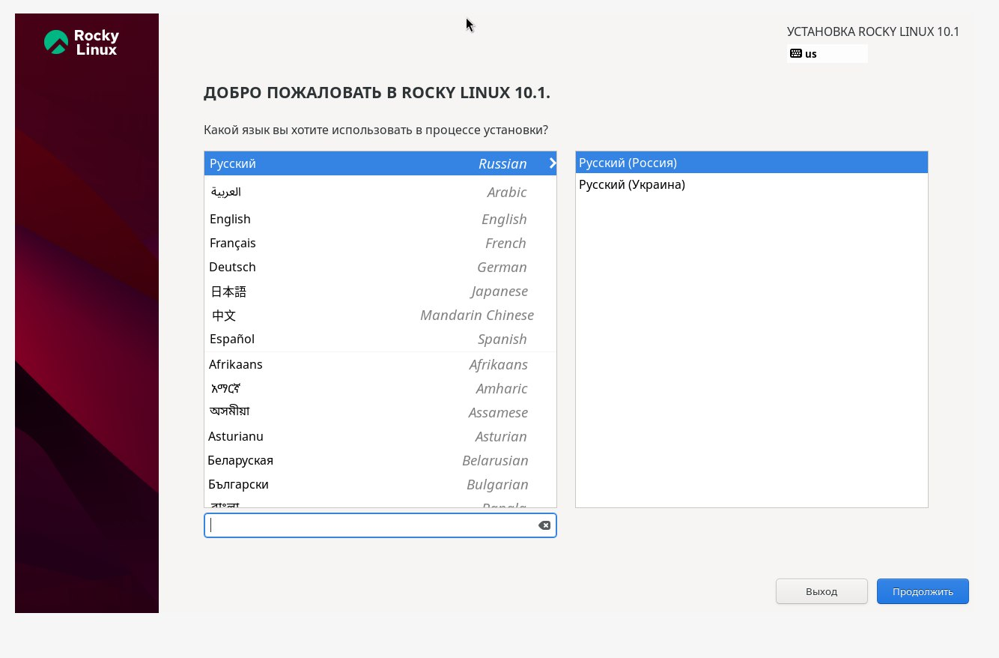

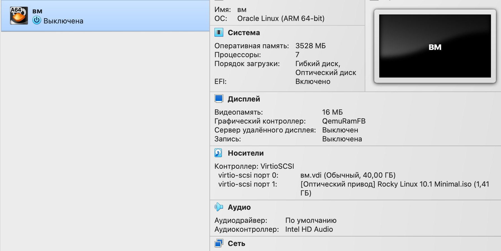

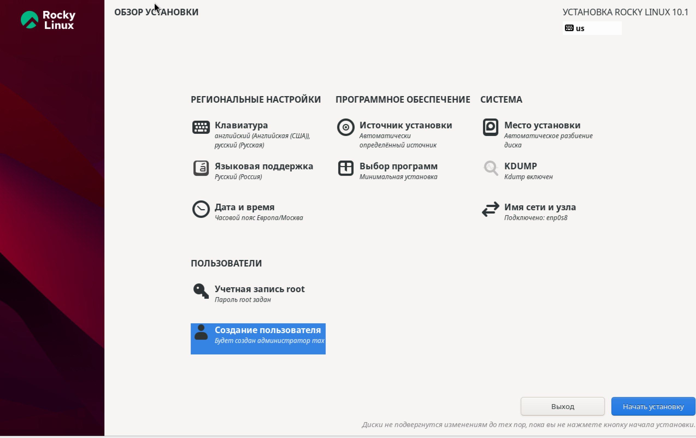

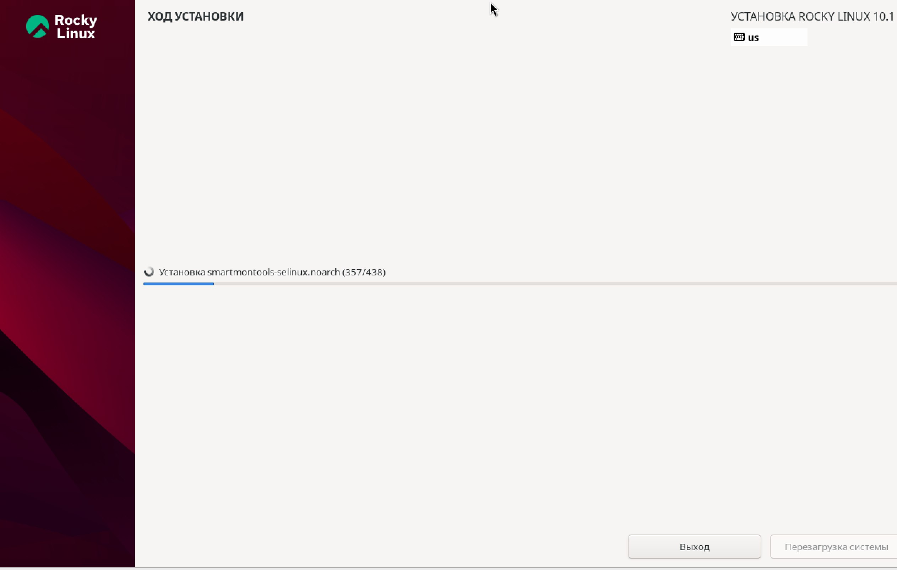

## 2. Настройка сети

1. В процессе настройки системы проверил настройки сети, выполнив команду:

   nmcli device status

2. Настроил DNS сервера вручную, добавив их в файл **/etc/resolv.conf**.
3. Проверил работу сети с помощью команды:

   ping google.com

4. Выполнил команду:

   ip route

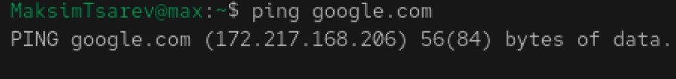

## 3. Создание пользователя

1. После установки системы вошел в терминал и создал нового пользователя с правами администратора, используя следующие команды:

   sudo adduser MaksimTsarev
   sudo passwd MaksimTsarev
   sudo usermod -aG wheel MaksimTsarev

2. Установил пароль для пользователя.

## 4. Тестирование соединения

1. Проверил доступность интернета с помощью команды:

   ping google.com

2. Получил ответ от [google.com](https://google.com), что подтверждает правильность настройки сети.

## 5. Сбор информации о системе

## 5.1. Получение информации о версии ядра

Выполнил команду:

sudo dmesg | grep -i "Linux version"

Результат:

Linux version 6.12.0-124.8.1.el10_1.aarch64

## 5.2. Получение информации о частоте процессора

Выполнил команду:

lscpu

Результат:

Architecture: aarch64
CPU(s): 7
BogoMIPS: 48.00

## 5.3. Получение информации о модели процессора

Выполнил команду:

cat /proc/cpuinfo

Результат:

processor : 0
BogoMIPS : 48.00
CPU architecture: 8

## 5.4. Проверка объема доступной памяти

Выполнил команду:

free -h

Результат:

Mem: 2.9Gi 1.2Gi 1.0Gi
Swap: 3.2Gi 0B 3.2Gi

## 5.5. Проверка гипервизора

Выполнил команду:

lscpu | grep Hypervisor

Результат:

Не вывелось данных о гипервизоре.

## 5.6. Проверка монтированных файловых систем

Выполнил команду:

df -h

Результат:

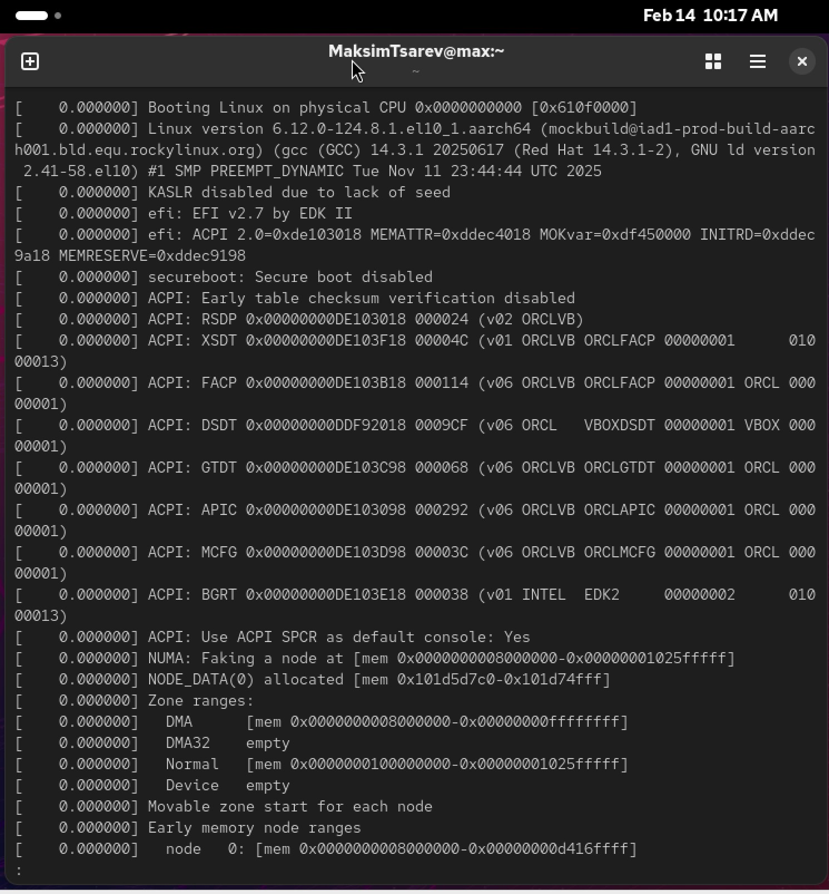

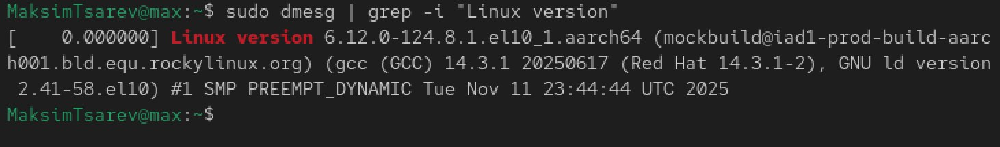

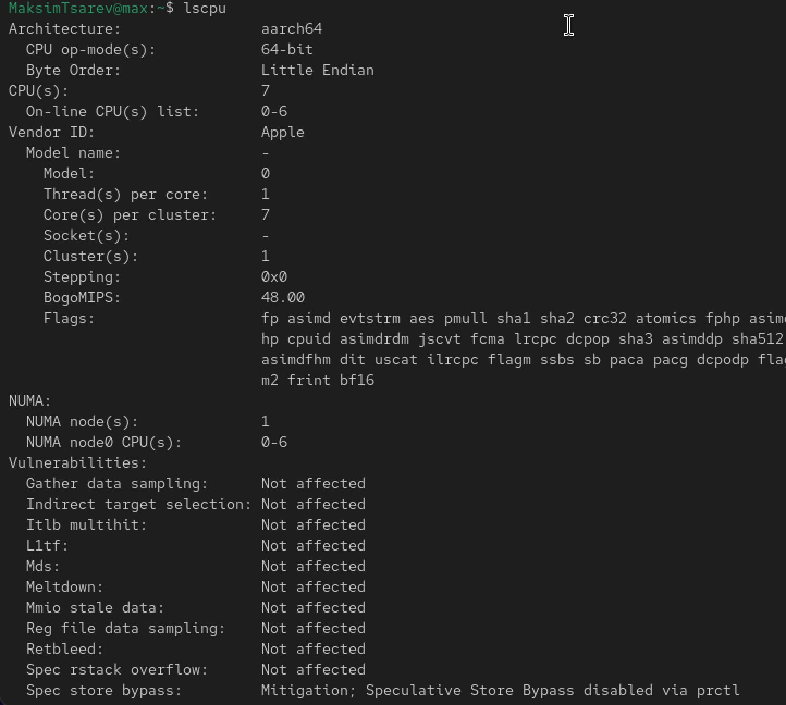

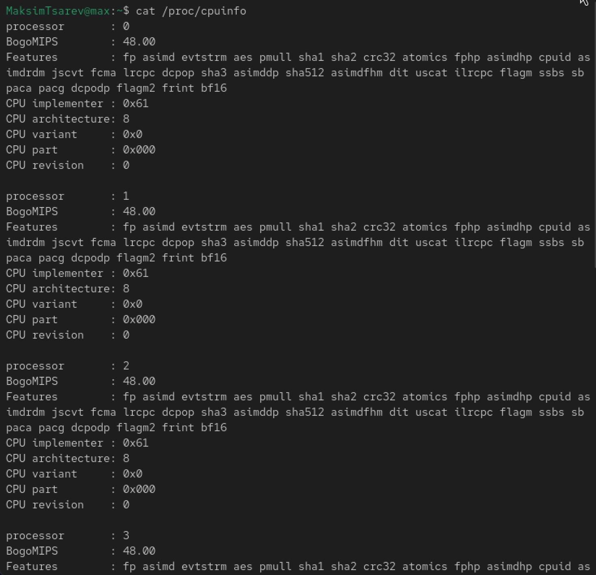

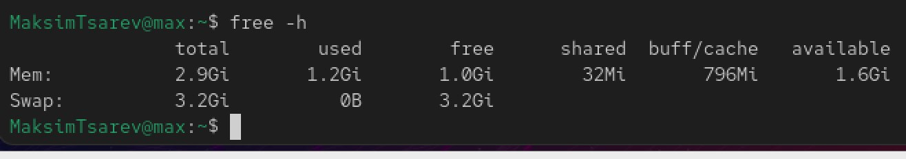

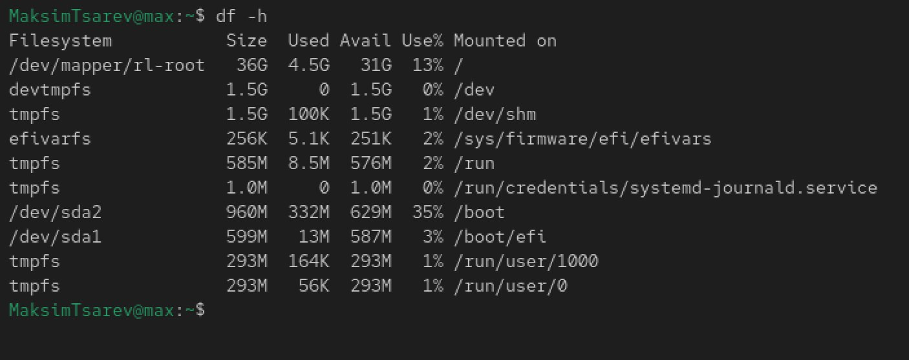

## Ответы на контрольные вопросы

1. Учетная запись содержит необходимые для идентификации пользователя при подключении к системе данные, а так же информацию для авторизации и учета: системного имени (user name) (оно может содержать только латинские буквы и знак нижнее подчеркивание, еще оно должно быть уникальным), идентификатор пользователя (UID) (уникальный идентификатор пользователя в системе, целое положительное число), идентификатор группы (CID) (группа, к к-рой относится пользователь. Она, как минимум, одна, по умолчанию - одна), полное имя (full name) (Могут быть ФИО), домашний каталог (home directory) (каталог, в к-рый попадает пользователь после входа в систему и в к-ром хранятся его данные), начальная оболочка (login shell) (командная оболочка, к-рая запускается при входе в систему).

2. Для получения справки по команде: <команда> —help; для перемещения по файловой системе - cd; для просмотра содержимого каталога - ls; для определения объёма каталога - du <имя каталога>; для создания / удаления каталогов - mkdir/rmdir; для создания / удаления файлов - touch/rm; для задания определённых прав на файл / каталог - chmod; для просмотра истории команд - history

3. Файловая система - это порядок, определяющий способ организации и хранения и именования данных на различных носителях информации. Примеры: FAT32 представляет собой пространство, разделенное на три части: олна область для служебных структур, форма указателей в виде таблиц и зона для хранения самих файлов. ext3/ext4 - журналируемая файловая система, используемая в основном в ОС с ядром Linux.

4. С помощью команды df, введя ее в терминале. Это утилита, которая показывает список всех файловых систем по именам устройств, сообщает их размер и данные о памяти. Также посмотреть подмонтированные файловые системы можно с помощью утилиты mount.

5. Чтобы удалить зависший процесс, вначале мы должны узнать, какой у него id: используем команду ps. Далее в терминале вводим команду kill < id процесса >. Или можно использовать утилиту killall, что "убьет" все процессы, которые есть в данный момент, для этого не нужно знать id процесса.

## Выводы

Я приобрел практические навыки
установки операционной системы на виртуальную машину, настройки ми-
нимально необходимых для дальнейшей работы сервисов.

