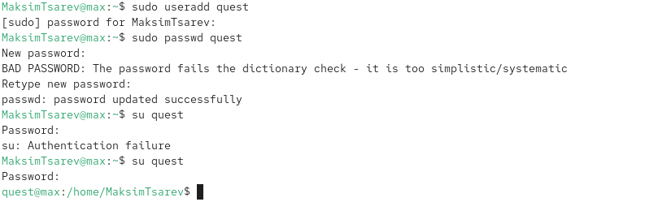
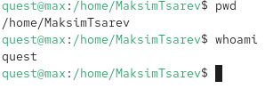
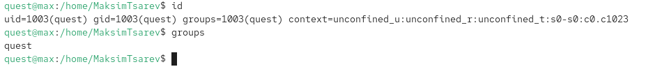
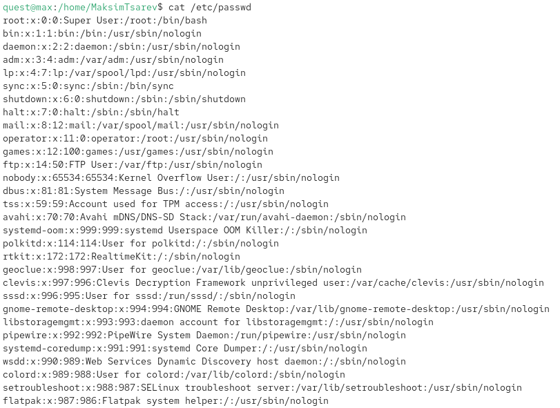
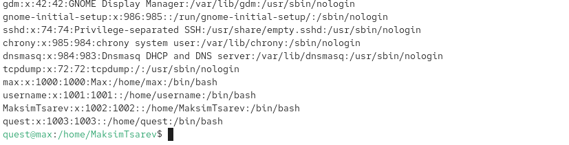
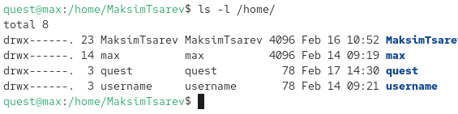
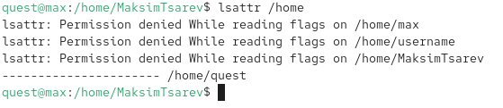
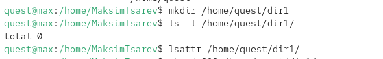
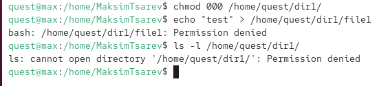

---
## Front matter
title: "Отчет по лабораторной работе №1"
subtitle: "Основы информационной безопасности"
author: "Царев Максим"

## Generic options
lang: ru-RU
toc-title: "Содержание"

## Bibliography
bibliography: bib/cite.bib
csl: pandoc/csl/gost-r-7-0-5-2008-numeric.csl

## Pdf output format
toc: true # Table of contents
toc-depth: 2
lof: true # List of figures
lot: true # List of tables
fontsize: 12pt
linestretch: 1.5
papersize: a4
documentclass: scrreprt

## I18n polyglossia
polyglossia-lang:
  name: russian
  options:
    - spelling=modern
    - babelshorthands=true
polyglossia-otherlangs:
  name: english

## I18n babel
babel-lang: russian
babel-otherlangs: english

## Fonts
mainfont: PT Serif
romanfont: PT Serif
sansfont: PT Sans
monofont: PT Mono
mainfontoptions: Ligatures=TeX
romanfontoptions: Ligatures=TeX
sansfontoptions: Ligatures=TeX,Scale=MatchLowercase
monofontoptions: Scale=MatchLowercase,Scale=0.9

## Biblatex
biblatex: true
biblio-style: "gost-numeric"
biblatexoptions:
  - parentracker=true
  - backend=biber
  - hyperref=auto
  - language=auto
  - autolang=other*
  - citestyle=gost-numeric

## Pandoc-crossref LaTeX customization
figureTitle: "Рис."
tableTitle: "Таблица"
listingTitle: "Листинг"
lofTitle: "Список иллюстраций"
lotTitle: "Список таблиц"
lolTitle: "Листинги"

## Misc options
indent: true
header-includes:
  - \usepackage{indentfirst}
  - \usepackage{float} # keep figures where there are in the text
  - \floatplacement{figure}{H} # keep figures where there are in the text
---

# Цель работы

Получение практических навыков работы в консоли с атрибутами файлов, закрепление теоретических основ дискреционного разграничения доступа в современных системах с открытым кодом на базе ОС Linux.

# Задание

1. В установленной при выполнении предыдущей лабораторной работы операционной системе создайте учётную запись пользователя `guest` (используя учётную запись администратора):
   ```bash
   useradd guest
   ```

2. Задайте пароль для пользователя `guest` (используя учётную запись администратора):
   ```bash
   passwd guest
   ```

3. Войдите в систему от имени пользователя `guest`.



4. Определите директорию, в которой вы находитесь, командой `pwd`. Сравните её с приглашением командной строки. Определите, является ли она вашей домашней директорией. Если нет, зайдите в домашнюю директорию.

5. Уточните имя вашего пользователя командой `whoami`.



6. Уточните имя вашего пользователя, его группу, а также группы, куда входит пользователь, командой `id`. Выведенные значения `uid`, `gid` и др. запомните. Сравните вывод `id` с выводом команды `groups`.



7. Сравните полученную информацию об имени пользователя с данными, выводимыми в приглашении командной строки.

8. Просмотрите файл `/etc/passwd` командой:
   ```bash
   cat /etc/passwd
   ```
   Найдите в нём свою учётную запись. Определите `uid` пользователя. Определите `gid` пользователя. Сравните найденные значения с полученными в предыдущих пунктах.





9. Определите существующие в системе директории командой:
   ```bash
   ls -l /home/
   ```
   Удалось ли вам получить список поддиректорий директории `/home`? Какие права установлены на директориях?



10. Проверьте, какие расширенные атрибуты установлены на поддиректориях, находящихся в директории `/home`, командой:
    ```bash
    lsattr /home
    ```
    Получили ли вы вывод с расширенными атрибутами директорий других пользователей?



11. Создайте в домашней директории поддиректорию `dir1` командой:
    ```bash
    mkdir dir1
    ```
    Определите командами `ls -l` и `lsattr`, какие права доступа и расширенные атрибуты были выставлены на директорию `dir1`.



12. Снимите с директории `dir1` все атрибуты командой:
    ```bash
    chmod 000 dir1
    ```
    Проверьте с помощью команды `ls -l`, что атрибуты были сняты.



13. Попытайтесь создать в директории `dir1` файл `file1` командой:
    ```bash
    echo "test" > /home/guest/dir1/file1
    ```
    Объясните, почему вы получили отказ в выполнении операции по созданию файла? Оцените, как сообщение об ошибке отразилось на создании файла? Проверьте командой:
    ```bash
    ls -l /home/guest/dir1
    ```
    Действительно ли файл `file1` не находится внутри директории `dir1`?


14. Заполните таблицу «Установленные права и разрешённые действия» (см. табл. 2.1), выполняя действия от имени владельца директории (файлов), определив опытным путём, какие операции разрешены, а какие нет.

**Таблица 2.1 — Установленные права и разрешённые действия**
| Права директории | Права файла | Создание файла | Удаление файла | Запись в файл | Чтение файла | Смена директории | Просмотр файлов | Переименование файла | Смена атрибутов файла |
|------------------|-------------|----------------|----------------|---------------|--------------|------------------|-----------------|----------------------|------------------------|
| d--------         | -           | -              | -              | -             | -            | -                | -               | -                    | -                      |
| d--x---           | -           | -              | -              | +             | -            | -                | +               | -                    | -                      |
| drwx------        | -rwx------  | +              | +              | +             | +            | +                | +               | +                    | +                      |

15. На основании заполненной таблицы определите те или иные минимально необходимые права для выполнения операций внутри директории `dir1`, заполните табл. 2.2.

**Таблица 2.2 — Минимальные права для совершения операций**
| Операция                  | Минимальные права на директорию | Минимальные права на файл |
|---------------------------|---------------------------------|----------------------------|
| Создание файла            | 777                             | 777                        |
| Удаление файла            | 777                             | 777                        |
| Чтение файла              | 777                             | 444                        |
| Запись в файл             | 777                             | 666                        |
| Переименование            | 777                             | 777                        |
| Создание поддиректории    | 777                             | 777                        |
| Удаление поддиректории    | 777                             | 777                        |

# Вывод
Полученил практические навыки работы в консоли с атрибутами файлов, закрепление теоретических основ дискреционного разграничения доступа в современных системах с открытым кодом на базе ОС Linux.